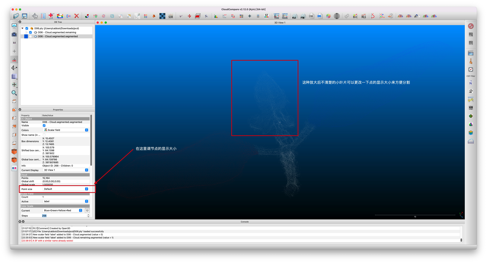
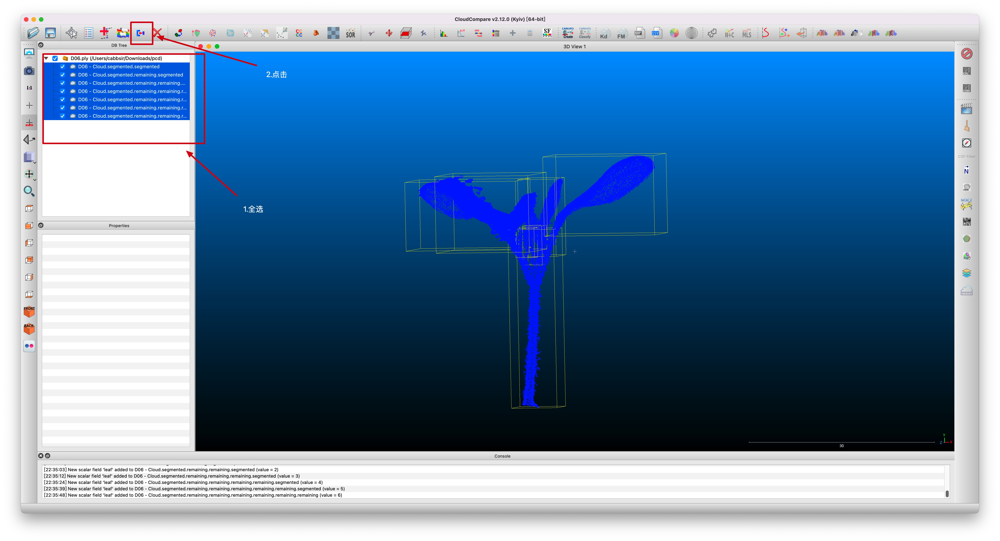

# CloudCompare 点云标记方法

## 0x00 分割点云

### 小叶片处理方法

### 重叠小叶片处理方法

## 0x01 添加标签

### 这里的标签名自己定义，但是每次都需要填一样的，建议label或者默认，注意茎叶的标签名都要相同

### 这里的数值，每一个叶片的数值必须不同(从1开始每次自增1)，茎的数值要设置为0

## 0x02 合并点云

### 标记完成的点云如下

## 0x03 保存
### 保存成ply格式 ascii编码

