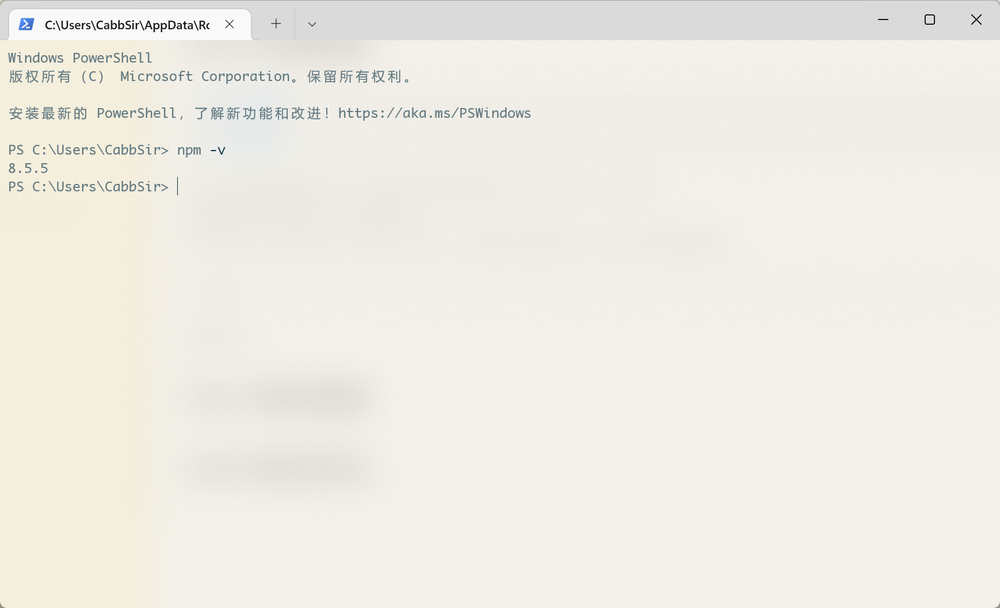
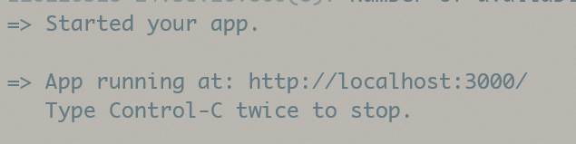
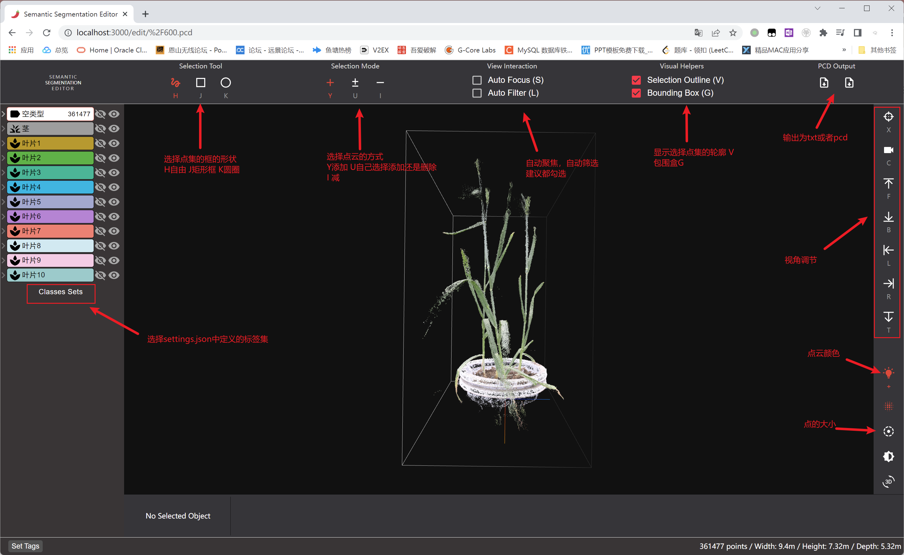

# Semantic Segmentation Editor(SSE) 使用方法

## 0x00 环境准备
> [Node.js环境](http://doc.cabbsir.com/node.msi)
  [VC++环境](http://doc.cabbsir.com/VC_redist.x64.exe)
  [SSE文件夹](http://doc.cabbsir.com/SSE.zip)

1. 点击上述链接直接下载，解压SSE到任意位置（例如D:\Code\SSE\）
2. 安装好nodejs和vc++运行环境
3. 打开PowerShell工具，输入如下代码，如果显示出版本号，那么环境准备成功
``` shell
npm -v
```



## 0x01 软件安装
1. 使用PowerShell工具进入到SSE目录中（本例中路径为D:\Code\SSE\）
``` shell
cd D:\Code\SSE
```
2. 利用Node安装meteor环境
``` shell
npm install meteor -g
```
注意这一步可能会等待很久，如果超过半小时还没有成功那么重新执行1中步骤，然后输入下面内容
``` shell
npm --registry https://registry.npmmirror.com/ install meteor -g
```
3. 安装成功运行SSE
``` shell
# 注意这一步也可能需要时间比较长
meteor npm install
meteor npm start
```
运行成功如图所示，此时浏览器访问 http://localhost:3000 即可开始标注


## 0x02 标记方法
1. settings.json
SSE目录中的settings.json文件可以设置**读取**和**输出**文件的目录以及**标签**
默认的配置文件如下
- 点云文件存放 **C:\Users\\<你的用户名>\sse-images\\** 目录
- 标记结果输出 **C:\Users\\<你的用户名>\sse-internal\\** 目录

2. 页面基本操作


3. 鼠标操作

| 按键 | 操作|
|--|--|
|鼠标左键 | 围绕当前焦点旋转点云(默认为点云中心)，单击单个点将其添加到当前点集中 |
|鼠标滚轮| 放大/缩小 |
|鼠标中键|(或 Ctrl+单击) 更改相机的焦点 |
|鼠标右键| 选择点集，具体取决于当前的选择工具和选择模式|
|键盘方向键 | 移动视角 |

4. 开始标记(以叶片举例)
  - 选择一个叶片的大概区域
  - 自动筛选后仔细框选叶片点云，点击下方Create Object
  - 点击标签即可保存，点击左键返回
  - 如果选择错误可以将内容标记为空类型，然后再次标记
  - 技巧，标记过的点云可以点击对应右侧的**眼睛**隐藏以便后续标记


5. 保存标记
右上角输出pcd文件即可

